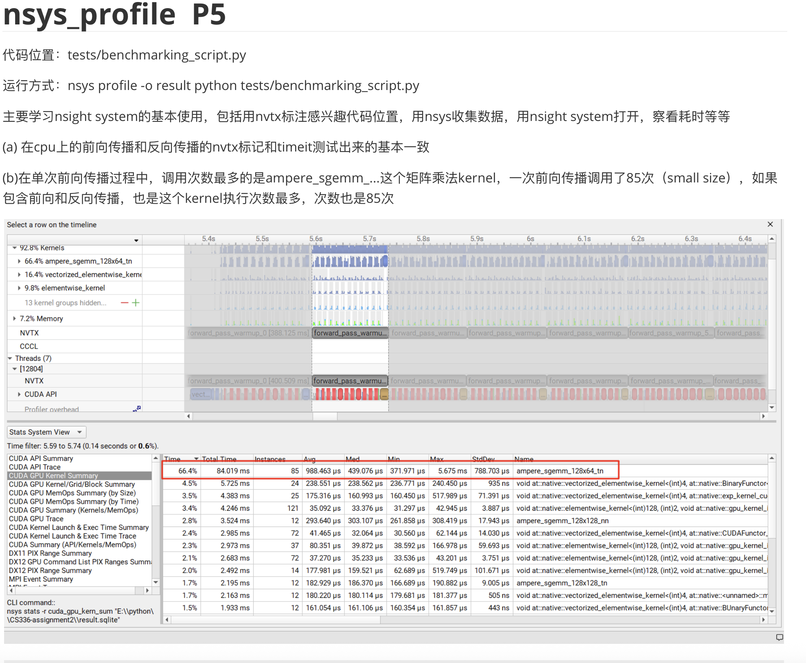
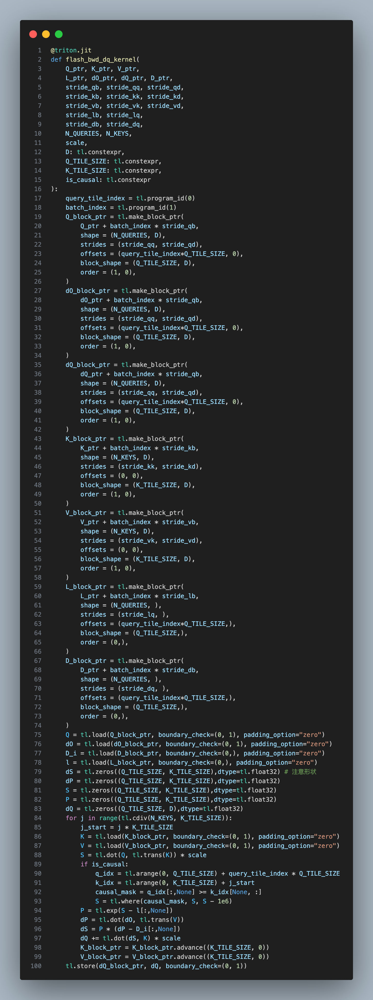
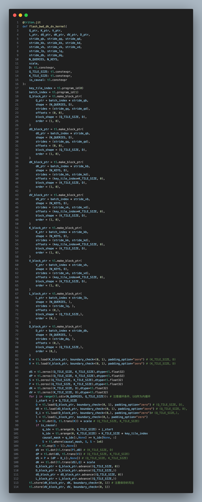

# FlashAttentionTritonLab
你是否经常听说Flash Attention这个超级大模型训练推理加速器，却一直没有下定决心好好学习它，或者被一大堆公式困扰着迟迟无法理解核心原理。

你又是否总感觉用Triton写算子高高在上，可以加速模型各部分速度，充分压榨GPU性能，看到入门代码示例就望而却步。

你需要看看这个项目啦！

完成本项目后，和本人上一个完成的[从0手写大模型](https://github.com/Sherlock1956/TransformerFromScratch)感觉类似，其实Flash Attention的原理以及如何用Triton来实现并不复杂，你需要的只是静下心来好好理解体会，普通人也都能学会！（不过至少还是要会求导和线性代数哈哈）

如果你觉得本项目对你有帮助，欢迎给出你的Github Star🌟，也欢迎对本人的代码批评指正，提出Github Issue / Github PR : )
## 项目概述

FlashAttentionTritonLab带你简单入门AI System，主要有两个部分重要内容
1. 写profile benchmark脚本来评估模型的各方面性能，包括运行时间，显存占用等。学习如何使用nsight system可视化GPU运行细节，如果在代码中使用nvtx标注感兴趣部分的运行时间等等。

  <div align="center">
    
  </div>

  

2. 带你从学习理解Flash Attention，到用Pytorch简单实现Flash Attention，再用Triton实现完整的Flash Attention2前向传播+反向传播。并且深入对比不同模型大小，数据大小的情况下Flash Attention的加速表现。

   

**注意**：请充分配套使用test_logs.md文件和cs336_spring2025_assignment2_systems.pdf文件，保证让你对Flash attention和Triton理解得明明白白: )

## 项目结构

```
FlashAttentionTritonLab/
├── README.md                          # 项目说明文档
├── LICENSE                            # 开源许可证
├── pyproject.toml                     # Python 项目配置文件
├── uv.lock                           # 依赖锁定文件
├── cs336_spring2025_assignment2_systems.pdf  # 作业指导书
├── test_logs.md                      # 测试日志和结果记录
├── assets/                           # 图片和资源文件
│   ├── image1.png - image9.png       # 实验结果截图和图表
├── tests/                            # 核心实现和测试代码
│   ├── __init__.py                   # 包初始化文件
│   ├── adapters.py                   # Flash Attention 适配器
│   ├── basic_modules.py              # 基础模块（来自其他仓库）
│   ├── benchmarking_attention.py     # Attention 性能基准测试
│   ├── benchmarking_script.py        # 完整模型基准测试脚本
│   ├── config.py                     # 配置参数
│   ├── flash_attention_modules.py    # Flash Attention Triton 实现
│   ├── mixed_presicion_accumulations.py  # 混合精度累积实验
│   ├── test_attention.py             # Attention 功能测试
│   └── weighted_sum.py               # Triton 加权求和示例

```

## 核心模块详解

### 1. Flash Attention 实现模块

#### `flash_attention_modules.py`
- **作用**: 包含基于 Triton 的 Flash Attention 2 完整实现，也包括逐步探索学习实现Flash Attention的过程（Pytorch Implemented Flash Attention）
- **主要功能**:
  - Flash Attention 前向传播 Triton 内核
  - Flash Attention 反向传播 Triton 内核（包括 dQ、dK、dV 计算）
  - 自动微分功能封装
  - 内存优化的分块计算
- **关键特性**:
  - 支持因果掩码（causal masking）
  - 内存高效的计算实现
  - 与标准 PyTorch attention 兼容的接口

#### `adapters.py`
- **作用**: 提供 Flash Attention 的适配器接口，在完成作业中的测试时需要调用该模块。
- **主要功能**:
  - `get_flashattention_autograd_function_pytorch()`: 返回 PyTorch 标准实现
  - `get_flashattention_autograd_function_triton()`: 返回 Triton 优化实现
  - 统一的接口设计便于切换不同实现

### 2. 性能基准测试模块

#### `benchmarking_attention.py`
- **作用**: 专门针对 Attention 机制的性能测试
- **主要功能**:
  - 对比标准 Attention 和 Triton Flash Attention 的性能
  - 测量前向传播和反向传播的执行时间
  - GPU 内存使用情况监控
  - 支持多种模型维度和序列长度的测试
- **测试参数**:
  - d_model: [16, 32, 64, 128]
  - seq_length: [256, 1024, 4096, 8192, 16384]

#### `benchmarking_script.py`
- **作用**: 完整 Transformer 模型的端到端性能测试
- **主要功能**:
  - 集成完整的 Transformer 语言模型
  - 支持不同规模模型的性能对比
  - 包含前向传播、反向传播和优化器更新的完整训练流程
  - NVTX 性能分析支持

### 3. 辅助模块

#### `config.py`
- **作用**: 统一的配置管理
- **包含参数**:
  - 模型架构参数（d_model, num_layers, num_heads 等）
  - 训练参数（学习率、批次大小等）
  - 数据路径和设备配置

#### `test_attention.py`
- **作用**: Attention 模块的功能正确性测试
- **主要功能**:
  - 验证 Flash Attention 实现的数值正确性
  - 梯度计算正确性检查
  - 与标准实现的对比测试

#### `basic_modules.py`
- **来源**: 该模块来自本人之前自己实现的[从0手写大模型](https://github.com/Sherlock1956/TransformerFromScratch)
- **作用**: 提供基础的 Transformer 组件


### 4. 实验和学习模块

#### `weighted_sum.py`
- **作用**: Triton 编程的入门示例
- **主要功能**:
  - 展示如何编写基础的 Triton 内核
  - 加权求和操作的 GPU 实现
  - Triton 编程模式的学习样例

#### `mixed_presicion_accumulations.py`
- **作用**: 混合精度计算的实验
- **主要功能**:
  - 演示不同精度累积的数值差异
  - float32 vs float16 精度对比
  - 混合精度策略的影响分析


## 使用说明

### 1. 环境安装
- 推荐使用uv管理项目环境
```bash
cd FlashAttentionTritonLab
uv sync
source .venv/bin/activate
```


### 2. 运行 Attention 基准测试
```bash
python tests/benchmarking_attention.py
```

### 3. 运行完整模型基准测试
```bash
python tests/benchmarking_script.py
```

### 4. 运行CS336-assignment2中作业测试
按照作业指导书中测试代码直接在根目录运行即可

## 性能分析

项目支持使用 NVIDIA Nsight Systems 进行深度性能分析：
- 使用 NVTX 标记关键代码段
- 支持 GPU 内核级别的性能分析
- 内存使用情况监控

## 实验结果

该项目所有实现过程都记录在`test_logs.md`文件中，包含：
- 不同模型规模的性能对比
- GPU 内核执行时间分析
- 内存使用优化效果
- Flash Attention vs 标准 Attention 的性能提升
- ......
